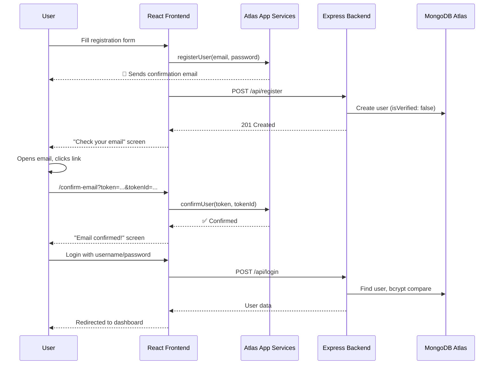

# MindBloom — Migration & Auth Walkthrough

## ✅ Phase 1: Database Migration — COMPLETE

All mock data has been migrated from `data.json` to MongoDB Atlas.

### What Changed

#### New Backend Structure

```
backend/
├── config/db.js           # Mongoose connection
├── models/
│   ├── User.js            # User schema (with email, realmUserId, isVerified)
│   ├── Question.js        # Question schema (ObjectId refs to User)
│   ├── Article.js         # Article schema
│   └── Quiz.js            # Quiz schema
├── routes/
│   ├── auth.js            # POST /api/login, POST /api/register, PUT /api/users/:id/verify
│   ├── questions.js       # Full CRUD for questions
│   ├── articles.js        # GET, approve, delete articles
│   ├── users.js           # GET all users, DELETE user
│   └── stats.js           # GET /api/stats, GET /api/quizzes
├── seed.js                # One-time seeding script (already run ✅)
├── server.js              # Refactored — uses dotenv, Mongoose, route modules
├── .env                   # MongoDB URI + PORT
└── data.json              # Original data (kept as backup)
```

#### Key Design Decisions

- **Passwords hashed with bcrypt** — All seeded user passwords are hashed, but login works with original plaintext values (`child123`, `counselor123`, `admin123`).
- **Old IDs mapped to ObjectIds** — Foreign keys (`userId`, `assignedTo`) correctly reference new MongoDB `_id` values.
- **Mongoose `toJSON()` provides `id` virtual** — Frontend code using `.id` continues to work without changes.
- **`sparse` unique index on email** — Existing users without email (seeded data) don't conflict.

#### Seeding Results

| Collection | Documents |
|-----------|-----------|
| users     | 8         |
| questions | 4         |
| articles  | 4         |
| quizzes   | 2         |

---

## ✅ Phase 2: Atlas Auth — Email Verification — CODE COMPLETE

### What Changed in Frontend

| File | Change |
|------|--------|
| [realm.js](file:///c:/Users/adity/OneDrive/Desktop/FSDL_FINAL/MindBloom-teen-guidance-portal/frontend/src/config/realm.js) | **[NEW]** Realm App singleton |
| [ConfirmEmail.jsx](file:///c:/Users/adity/OneDrive/Desktop/FSDL_FINAL/MindBloom-teen-guidance-portal/frontend/src/pages/ConfirmEmail.jsx) | **[NEW]** Email confirmation page with 3 states |
| [Register.jsx](file:///c:/Users/adity/OneDrive/Desktop/FSDL_FINAL/MindBloom-teen-guidance-portal/frontend/src/pages/Register.jsx) | **[MODIFIED]** Added email field + Realm registration + "check email" success screen |
| [App.jsx](file:///c:/Users/adity/OneDrive/Desktop/FSDL_FINAL/MindBloom-teen-guidance-portal/frontend/src/App.jsx) | **[MODIFIED]** Added `/confirm-email` route |
| [.env](file:///c:/Users/adity/OneDrive/Desktop/FSDL_FINAL/MindBloom-teen-guidance-portal/frontend/.env) | **[NEW]** `VITE_REALM_APP_ID` placeholder |

### What Changed in Backend

| File | Change |
|------|--------|
| [auth.js](file:///c:/Users/adity/OneDrive/Desktop/FSDL_FINAL/MindBloom-teen-guidance-portal/backend/routes/auth.js) | Registration accepts `email`, has `PUT /api/users/:id/verify` endpoint |

---

## 🔧 Atlas App Services — Dashboard Setup Guide

> [!IMPORTANT]
> You MUST complete these manual steps in the MongoDB Atlas dashboard before registration with email verification will work.

### Step 1: Create an App Services Application

1. Go to [MongoDB Atlas](https://cloud.mongodb.com) and sign in
2. In the left sidebar, click **"App Services"** (or go to `https://cloud.mongodb.com/v2#/org/.../appServices`)
3. Click **"Create a New App"**
4. Configure:
   - **App Name**: `MindBloom` (or any name you prefer)
   - **Cluster**: Select your `MindCluster` cluster
   - **Deployment Model**: Leave as default (Global)
5. Click **"Create App"**
6. **⚠️ Copy your App ID** — It appears at the top of the dashboard (e.g., `mindbloom-abcde`). You'll need this in the next section.

### Step 2: Set Your App ID in the Frontend

Open `frontend/.env` and replace the placeholder:

```
VITE_REALM_APP_ID=mindbloom-abcde
```

> Replace `mindbloom-abcde` with your **actual** App ID from Step 1.

### Step 3: Enable Email/Password Authentication

1. In your App Services dashboard, click **"Authentication"** in the left sidebar
2. Find **"Email/Password"** in the providers list and click on it
3. Toggle the switch to **Enable** it
4. Configure these exact settings:

#### User Confirmation Method
- **Select**: ✅ **"Send a confirmation email"**

#### Email Confirmation URL
```
http://localhost:3000/confirm-email
```

> [!WARNING]
> When deploying to production, change this URL to your actual domain, e.g.:
> `https://mindbloom.yoursite.com/confirm-email`

#### Password Reset URL
```
http://localhost:3000/reset-password
```
_(You can set this for future use — we haven't built this page yet)_

#### Email Configuration
- Leave the **email sender** fields as default (Atlas will send from its own domain)
- If Atlas lets you customize the **subject line**, set it to:
  ```
  Confirm your MindBloom signup
  ```

5. Click **"Save Draft"** at the bottom
6. Click **"Review Draft & Deploy"** at the top of the page → then click **"Deploy"**

### Step 4: Verify Everything is Deployed

1. After deploying, go back to **Authentication → Email/Password**
2. Verify the status says **"Enabled"**
3. Check your **App ID** at the top of the dashboard matches what you put in `frontend/.env`

---

## 🧪 Testing the Complete Flow

### Start Both Servers

```bash
# Terminal 1 — Backend
cd backend
npm run dev

# Terminal 2 — Frontend  
cd frontend
npm run dev
```

### Test Phase 1 (Database Migration)

1. Open `http://localhost:3000`
2. Use demo login buttons:
   - **Child**: username `child`, password `child123`
   - **Counselor**: username `counselor`, password `counselor123`
   - **Admin**: username `admin`, password `admin123`
3. Verify all features work: viewing questions, creating questions, reading articles, taking quizzes, admin dashboard

### Test Phase 2 (Email Verification)

1. Click **"Create account"** on the login page
2. Fill in the form with:
   - Name, Age (10-13)
   - Email: `Aditya.s.chavan247@gmail.com`
   - Username, Password (min 6 chars)
3. Click **"Create account"** → You should see the **"Check your email"** screen
4. Open your email inbox → Find the confirmation email from Atlas
5. Click the confirmation link → You'll be redirected to `http://localhost:3000/confirm-email?token=...&tokenId=...`
6. The page should show **"Email confirmed!"** with a green checkmark
7. Click **"Go to Login"** → Sign in with your username and password

### User Flow Diagram


